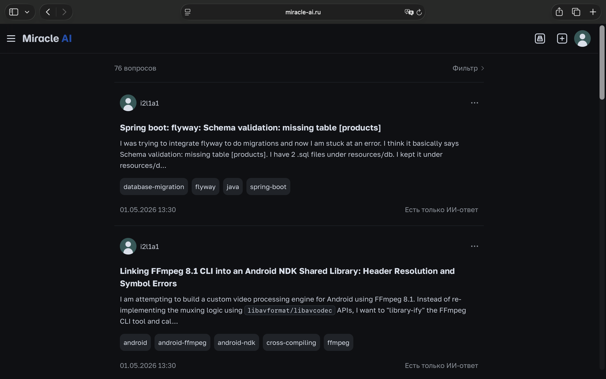

# Miracle AI

Try it now: [miracle-ai.ru](https://miracle-ai.ru)

## Overview

**Miracle AI** is a Q&A platform where users post questions and get an automatic answer from AI, while the community can
add human answers, vote, and mark the best solution.

The project combines classic forum ideas (tags, feeds, accepted answers) with well‑crafted prompt engineering
techniques. Bringing these two forces together makes the platform more effective than using either approach alone.

## AI generation

The project implements a multi‑step prompt chain. This chain improves answer accuracy, reduces hallucinations, makes
responses more factual and reliable, and ensures a clear, consistent style.

| Step                | Purpose                                                                                                                   |
|---------------------|---------------------------------------------------------------------------------------------------------------------------|
| 1. Classification   | Determines question type: technical, advice, tutorial, current, or creative.                                              |
| 2. Fact gathering   | Lists reliable facts from the model's knowledge, flags uncertainty where relevant. Reduces hallucinations in later steps. |
| 3. Draft answer     | Writes a type‑specific reply in the question's language (tone and structure differ per type).                             |
| 4. Final refinement | Removes fluff and unwanted Markdown, keeps code in fenced blocks, aligns language and content with the fact list.         |

## Stack Overflow parsing

The project includes an import feature (accessible only to project administrators) that can import questions from Stack
Overflow for a chosen date range and publish them on the Miracle AI platform with an automatic AI answer. On large
forums, many questions stay without a useful reply for days or weeks. Visitors leave without a solution and authors stop
waiting. Importing questions from Stack Overflow solves this problem by giving those questions an immediate AI response
on Miracle AI.

## Installation and Setup

### On a production server

1. Rent a server (Linux recommended) and point your domain's DNS A record to the server's IP address.
2. Clone the repository onto the server.
3. Install Docker and Docker Compose.
4. Create and fill in `backend/.env` with production values (use `backend/.env.example` as a reference).
5. Create the nginx configuration file `sudo nano /etc/nginx/sites-available/miracle-ai`, then copy the
   contents of `backend/miracle-ai.conf` into it.
7. Enable the site: `sudo ln -s /etc/nginx/sites-available/miracle-ai /etc/nginx/sites-enabled/`.
8. Test the nginx configuration: `sudo nginx -t`.
9. Restart nginx to apply the changes: `sudo systemctl restart nginx`.
10. Install Certbot and its nginx plugin: `sudo apt install certbot python3-certbot-nginx -y`.
11. Run Certbot to automatically obtain and install a certificate for your domain:
    `sudo certbot --nginx -d <your-url>` (Replace `<your-url>` with the domain you configured in step 1, e.g.
    miracle-ai.ru).
12. Start all services in detached mode: `docker compose -f docker-compose.prod.yml up -d --build`.

### Locally for development

1. Clone the repository.
2. Install Docker and Docker Compose.
3. Create and fill in `backend/.env` with production values (use `backend/.env.example` as a reference).
4. Start all services in detached mode: `docker compose -f docker-compose.dev.yml up -d --build`.

Then try visiting:

- Frontend: [http://localhost:3000](http://localhost:3000)
- API: [http://localhost:8080](http://localhost:8080/docs)

## Tech stack

### Backend

* **FastAPI** — REST API
* **Uvicorn** — ASGI server
* **SQLAlchemy** — async ORM
* **PostgreSQL** — database
* **Flyway** — SQL migrations
* **python-jose** + **passlib** + **bcrypt** — JWT access & refresh tokens, password hashing
* **LangChain** — LLM orchestration
* **OpenRouter** — model provider
* **langdetect** — question language detection
* **BeautifulSoup**, **Pygments** — HTML parsing, syntax hints
* **python-dotenv** — configuration

### Frontend

* **Next.js 16** — React framework, SSR/RSC
* **TypeScript** — typing
* **Tailwind CSS 4** — styling
* **react-markdown** — display answers and questions with readable text, line breaks, and highlighted code

### Infrastructure

* **Docker** + **Docker Compose** — containerization and orchestration of the whole stack (database, migrations, backend
  API,
  frontend)
* **nginx** — reverse proxy to unify frontend and backend API under one domain
* **[Timeweb Cloud](https://timeweb.cloud)** — VPS hosting provider
